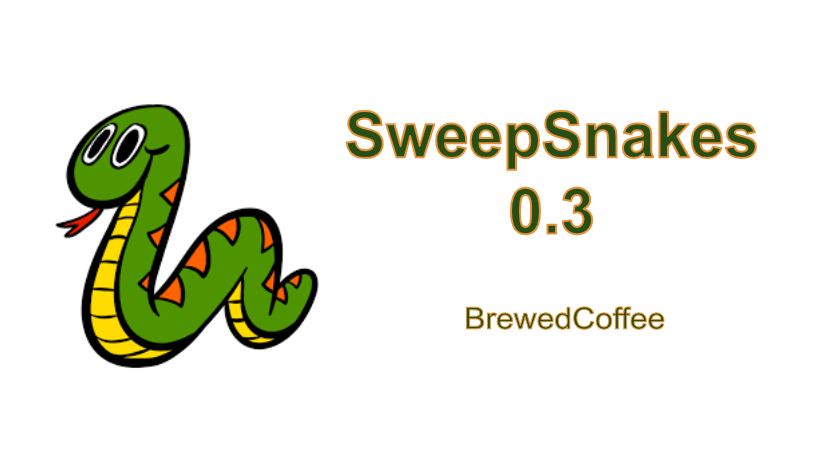

# Snakesweeper
 
This is my version of the classic Minesweeper, coded in C++.  

I learned about headers, pointers, binary operations, and used a 1D array to represent a 2D space.  
When selecting a tile, rows and columns start from 0!
